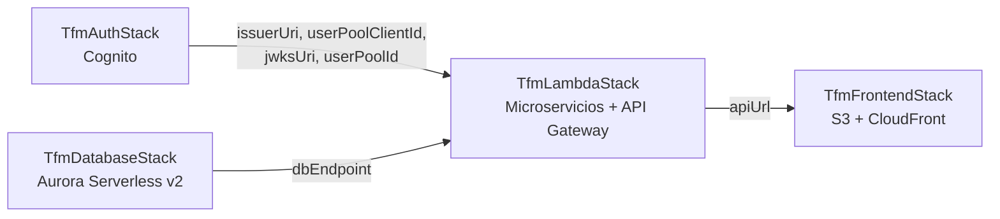

# Infraestructura como código (AWS CDK) — TFM Bandas de Música

Este documento describe cómo está organizada la infraestructura AWS del proyecto,
definida íntegramente en TypeScript mediante AWS CDK (carpeta `cdk/`). Sirve como
base narrativa para el apartado de infraestructura de la memoria del TFM: prioriza
el "cómo está montado y por qué" frente al detalle línea a línea.

El proyecto migra una aplicación de gestión de bandas de música, originalmente
desplegada como microservicios Spring Boot sobre Docker Compose, a una arquitectura
serverless en AWS: Lambda (Java 21 + SnapStart) para los microservicios de negocio,
Aurora Serverless v2 como base de datos relacional, Cognito como proveedor de
identidad, y S3 + CloudFront para el frontend React.

---

## 1. Visión general

### 1.1 Stacks que componen el proyecto

| Stack | Responsabilidad |
|---|---|
| `TfmAuthStack` | Autenticación y gestión de identidades con Amazon Cognito (User Pool, App Client, grupos de roles). |
| `TfmDatabaseStack` | Base de datos relacional: cluster Aurora Serverless v2 MySQL con SSL obligatorio, y publicación de parámetros de conexión en SSM. |
| `TfmLambdaStack` | Los cuatro microservicios de negocio como funciones Lambda (Identity, Users, Events, Surveys), el API Gateway HTTP API con JWT Authorizer, la Lambda de health-check de Aurora, y el rol IAM de despliegue backend para CI/CD. |
| `TfmFrontendStack` | Frontend React servido desde S3 + CloudFront, proveedor OIDC de GitHub y rol IAM de despliegue del frontend. |

### 1.2 Orden de despliegue y dependencias entre stacks

El entrypoint ([bin/cdk.ts](cdk/bin/cdk.ts)) instancia los stacks en un orden que
refleja sus dependencias, ya que CDK resuelve estas relaciones mediante
**cross-stack references** de CloudFormation (exports/imports automáticos, no
hardcodeo de valores):

1. **`TfmAuthStack`** se crea primero porque no depende de ningún otro stack.
2. **`TfmDatabaseStack`** también es independiente y puede crearse en paralelo
   conceptualmente, aunque en el código se instancia justo después.
3. **`TfmLambdaStack`** depende de ambos: recibe de `AuthStack` el `issuerUri`,
   `userPoolClientId`, `jwksUri` y `userPoolId` (para configurar el JWT Authorizer
   y las variables de entorno de las Lambdas), y de `DatabaseStack` el
   `dbEndpoint` (para el health-check de Aurora).
4. **`TfmFrontendStack`** se crea en último lugar porque necesita el
   `apiUrl` que expone `TfmLambdaStack`, para configurar el *behavior* `/api/*`
   de CloudFront apuntando al API Gateway correcto.

Esta cadena de dependencias implica un orden de despliegue obligatorio:
Auth/Database → Lambda → Frontend. CDK no permite destruir un stack mientras
otro consuma sus outputs, lo que actúa como salvaguarda: por ejemplo,
`TfmAuthStack` no puede eliminarse mientras `TfmLambdaStack` exista.

### 1.3 Diagrama de relaciones entre stacks



---

## 2. Detalle por stack

### 2.1 `TfmAuthStack` — Autenticación (Cognito)

**Recursos que crea:**
- User Pool de Cognito (`tfm-bandas`).
- Dominio Hosted UI de Cognito (subdominio `tfm-bandas-<accountId>.auth.eu-west-1.amazoncognito.com`).
- App Client público (`tfm-frontend`), con OAuth Authorization Code + PKCE.
- Dos grupos de usuario: `ADMIN` y `MUSICIAN`.
- Outputs: `UserPoolId`, `UserPoolClientId`, `JwksUri`, `IssuerUri`, `HostedUiBaseUrl`.

**Decisiones de diseño relevantes:**
- `selfSignUpEnabled: false` — solo el administrador da de alta usuarios, coherente
  con una app de gestión interna de banda; no tiene sentido el autoregistro público.
- Login por `username` o `email` indistintamente, replicando el comportamiento que
  tenía Keycloak en la Fase 1 (arquitectura Docker Compose).
- `accountRecovery: EMAIL_ONLY` — se evita SMS para no incurrir en costes de SNS.
- App Client sin secreto (`generateSecret: false`) porque es un cliente público
  (SPA React); la seguridad se delega en PKCE en lugar de un secreto que un
  cliente público no podría custodiar de forma segura.
- Los roles se modelan como **grupos de Cognito** en lugar de roles de Keycloak.
  El claim `cognito:groups` del JWT sustituye a `realm_access.roles`, y Spring
  Security se adapta para leer ese claim.
- `removalPolicy: DESTROY` — decisión explícita de entorno académico, para poder
  limpiar el entorno con `cdk destroy` sin dejar recursos huérfanos; en
  producción real sería `RETAIN`.

**Qué expone a otros stacks:** `userPoolId`, `userPoolClientId`, `jwksUri`,
`issuerUri` — los cuatro valores que `TfmLambdaStack` necesita para construir el
JWT Authorizer de API Gateway y las variables de entorno de validación JWT de
cada Lambda.

### 2.2 `TfmDatabaseStack` — Base de datos (Aurora Serverless v2)

**Recursos que crea:**
- Security Group (`tfm-aurora-sg`) sobre la VPC por defecto de la cuenta, con el
  puerto 3306 abierto a cualquier IP.
- Cluster Parameter Group a nivel de cluster con `require_secure_transport: ON`.
- Cluster Aurora MySQL Serverless v2 (`TfmDatabase`), con una instancia *writer*
  serverless, publicidad de red activada (`publiclyAccessible: true`).
- Credenciales generadas automáticamente en Secrets Manager
  (`tfm/aurora/master-credentials`).
- Seis parámetros en SSM Parameter Store: endpoint, puerto, tres URLs JDBC (una
  por microservicio con esquema propio) y el usuario admin.
- Outputs: `DbEndpoint`, `DbPort`, `DbSecretArn`, `DbClusterIdentifier`.

**Decisiones de diseño relevantes:**
- **Sin VPC privada**: se usa la VPC por defecto y subredes públicas. La
  protección no viene del aislamiento de red sino de SSL obligatorio a nivel de
  cluster más credenciales en Secrets Manager/SSM. Esto permite que las Lambdas
  se conecten directamente sin necesidad de NAT Gateway (que tendría coste fijo
  mensual) ni de VPC endpoints adicionales.
- **Aurora Serverless v2 con `serverlessV2MinCapacity: 0`**: el código documenta
  explícitamente por qué se sustituyó un enfoque anterior (una Lambda
  *scheduler* que paraba/arrancaba RDS clásico): Aurora pausa y reanuda de forma
  nativa, sin los ciclos de recovery erráticos del scheduler previo, reanudando
  en ~15 segundos frente a los 7-10 minutos de un start/stop de RDS clásico. El
  coste en reposo es solo de almacenamiento.
- **Auto-pause a los 900 segundos (15 min)**, configurado mediante *escape
  hatch* porque el L2 de CDK no expone `SecondsUntilAutoPause` cuando
  `serverlessV2MinCapacity` es 0. El valor de 15 minutos se eligió pensando en
  que las sesiones de respuesta a encuestas duran 5-10 minutos: es margen
  suficiente para no pausar durante actividad real, y para pausar rápido cuando
  ya no hay uso.
- `deletionProtection: true` y `removalPolicy: RETAIN` — a diferencia del resto
  del proyecto (pensado para destruirse limpiamente), la base de datos se
  protege explícitamente contra borrado accidental, priorizando la
  persistencia de los datos sobre la comodidad de limpieza del entorno.
- Cifrado en reposo con KMS y backups de 7 días activados sin coste adicional
  en Aurora Serverless v2.
- El **ParameterGroup se define a nivel de cluster**, no de instancia, porque
  `require_secure_transport` tiene alcance global en Aurora MySQL.

**Qué expone a otros stacks:** `dbEndpoint`, `dbPort`, `dbClusterIdentifier`.
`TfmLambdaStack` usa `dbEndpoint` únicamente para que la Lambda de health-check
(`tfm-rds-health`) compruebe la disponibilidad de Aurora vía TCP; las
credenciales de conexión JDBC de los microservicios de negocio se leen aparte,
directamente desde SSM (ver apartado 6.2), no desde esta cross-stack reference.

### 2.3 `TfmFrontendStack` — Frontend (S3 + CloudFront)

**Recursos que crea:**
- Bucket S3 privado (`FrontendBucket`) con `BLOCK_ALL` de acceso público.
- CloudFront Function (`tfm-spa-routing`) para enrutado de SPA (React Router).
- Distribución CloudFront con:
  - *Behavior* por defecto → origen S3 vía Origin Access Control (OAC).
  - *Behavior* `/api/*` → origen HTTP API Gateway, caché deshabilitada.
  - *Behavior* `/health/*` → mismo origen API Gateway, caché deshabilitada.
- Proveedor OIDC de GitHub Actions (`token.actions.githubusercontent.com`).
- Rol IAM `tfm-github-actions-frontend-deploy` para el pipeline de despliegue del
  frontend.
- Outputs: `BucketName`, `CloudFrontURL`, `DistributionId`, `GithubActionsRoleArn`.

**Decisiones de diseño relevantes:**
- **CloudFront Function en vez de `errorResponses` 403/404 → `index.html`**: el
  código documenta que el enfoque de `errorResponses` se descartó porque no se
  puede acotar por *behavior* — se aplicaría a toda la distribución, incluido
  `/api/*`, convirtiendo 401/404 legítimos de la API (JWT inválido, recurso no
  encontrado) en una respuesta 200 con el HTML del frontend, además cacheada
  según la política del origen S3. La función, asociada solo al
  `defaultBehavior`, resuelve esto reescribiendo la URI antes de llegar a S3
  sin afectar nunca a `/api/*` ni `/health/*`.
- **Caché deshabilitada (`CACHING_DISABLED`) en `/api/*`**: las respuestas de la
  API son dinámicas; cachearlas mostraría datos desactualizados a los usuarios.
- **`ALL_VIEWER_EXCEPT_HOST_HEADER`** como *origin request policy* en `/api/*`:
  reenvía todos los headers del cliente al API Gateway, incluido
  `Authorization` con el JWT — sin esto, el token nunca llegaría a Lambda y
  todo devolvería 401.
- **Sin configuración CORS explícita** en el *behavior* `/api/*`: al servir
  frontend y API bajo el mismo dominio de CloudFront, el navegador no emite
  peticiones *cross-origin* y por tanto no hay preflight que gestionar.
- **Proveedor OIDC de GitHub** en vez de Access Keys estáticas: permite que
  GitHub Actions obtenga credenciales temporales asumiendo un rol IAM, sin
  secretos de larga duración almacenados en ningún sitio.
- El acceso del rol de GitHub Actions se restringe mediante `StringLike` sobre
  el claim `sub` del token OIDC, a los repositorios `tfm-*` del usuario del
  proyecto — principio de mínimo privilegio a nivel de repositorio.

**Qué expone a otros stacks:** nada — es el último eslabón de la cadena de
dependencias, solo consume `apiGatewayEndpoint` de `TfmLambdaStack`.

**Nota:** el proveedor OIDC de GitHub (`GithubOidcProvider`) se crea aquí, en
`TfmFrontendStack`, y `TfmLambdaStack` lo referencia por ARN
(`fromOpenIdConnectProviderArn`, sin crear un recurso nuevo) para construir su
propio rol de despliegue de backend. Es una dependencia implícita entre stacks
que no viaja por props explícitas de CDK, sino por un ARN construido con el
nombre fijo del proveedor OIDC (ver apartado "Preguntas abiertas").

---

## 3. `TfmLambdaStack` en detalle

Este es el stack más complejo del proyecto: alberga los cuatro microservicios de
negocio, el API Gateway, la Lambda de health-check y el rol de despliegue backend.

### 3.1 Patrón de organización: funciones constructoras puras sobre `scope`

En lugar de modelar cada pieza de infraestructura (Identity, Users, Events,
Surveys, API Gateway, rol de deploy) como una **subclase de `Construct`**
anidada, el proyecto usa **funciones puras** que reciben el `scope` (el propio
stack) como parámetro y registran los recursos directamente sobre él:

```ts
export function createIdentityLambda(scope: Construct, props, lambdaCode, api, jwtAuth): IdentityLambdaResult {
  const role = new iam.Role(scope, 'IdentityLambdaRole', { ... });
  const fn = new lambda.Function(scope, 'IdentityLambda', { ... role });
  // ...
  return { lambda: fn, alias };
}
```

Cada función vive en su propio fichero bajo `lib/lambda-constructs/`, y
`TfmLambdaStack` (en [lambda-stack.ts](cdk/lib/lambda-stack.ts)) simplemente las
invoca en secuencia, encadenando los resultados que unas necesitan de otras
(por ejemplo, `createHealthCheckLambda` recibe los alias `live` de las cuatro
Lambdas de negocio ya creadas).

Esta elección no es solo estilística: si en su lugar se hubiera modelado cada
Lambda como una clase `Construct` anidada (p. ej. `class IdentityConstruct
extends Construct`), CDK antepondría el *Construct ID* de esa clase a los
**Logical ID** de CloudFormation de todos los recursos internos (rol, función,
alias...). Con funciones puras que registran los recursos directamente sobre el
`scope` del stack, los Logical IDs quedan planos y estables
(`IdentityLambdaRole`, `IdentityLambda`, `IdentityAlias`...), reduciendo el
riesgo de que un refactor de la organización del código provoque un
reemplazo/recreación accidental de recursos en CloudFormation por cambio de
Logical ID.

### 3.2 Funciones constructoras

| Fichero | Qué construye | IAM necesario y por qué | Variables de entorno relevantes | Se comunica con |
|---|---|---|---|---|
| [api-gateway.ts](cdk/lib/lambda-constructs/api-gateway.ts) | `HttpApi` (API Gateway v2) + `HttpAuthorizer` JWT de Cognito | — (no crea roles; el JWT Authorizer es un recurso gestionado por API Gateway) | — | Cognito (JWKS para validar tokens) |
| [identity-lambda.ts](cdk/lib/lambda-constructs/identity-lambda.ts) | Lambda `tfm-identity` (Java 21) + alias `live` + ruta API | `cognito-idp:AdminCreateUser`, `AdminDeleteUser`, `AdminUpdateUserAttributes`, `AdminSetUserPassword`, `AdminGetUser`, gestión de grupos, etc., acotado al ARN del User Pool concreto — es el adaptador hacia la Cognito Admin API | `SPRING_PROFILES_ACTIVE`, `MAIN_CLASS`, `COGNITO_JWKS_URI`, `COGNITO_USER_POOL_ID`, `COGNITO_PERMITTED_ROLES`, `COGNITO_ISSUER_URI` | Cognito Admin API |
| [users-lambda.ts](cdk/lib/lambda-constructs/users-lambda.ts) | Bucket S3 de fotos de perfil + Lambda `tfm-users` + alias + rutas API | `s3:PutObject`/`GetObject` sobre el bucket de fotos, para generar *presigned URLs* | `SPRING_PROFILES_ACTIVE`, `MAIN_CLASS`, `COGNITO_JWKS_URI`, `COGNITO_ISSUER_URI`, `PROFILE_PICTURES_BUCKET`, TTLs de presigned URLs, `IDENTITY_SERVICE_URI`, `DB_URL`/`DB_USERNAME`/`DB_PASSWORD` | MS Identity (vía Feign/API Gateway), S3, Aurora |
| [events-lambda.ts](cdk/lib/lambda-constructs/events-lambda.ts) | Lambda `tfm-events` + alias + rutas API | Solo `AWSLambdaBasicExecutionRole` (logs) | `SPRING_PROFILES_ACTIVE`, `MAIN_CLASS`, `COGNITO_JWKS_URI`, `COGNITO_ISSUER_URI`, `SURVEYS_SERVICE_URI`, `SURVEYS_SERVICE_DELETE_BY_EVENT_ID_PATH`, `DB_URL`/`DB_USERNAME`/`DB_PASSWORD` | MS Surveys (vía Feign/API Gateway), Aurora |
| [surveys-lambda.ts](cdk/lib/lambda-constructs/surveys-lambda.ts) | Lambda `tfm-surveys` + alias + rutas API | Solo `AWSLambdaBasicExecutionRole` (logs) | `SPRING_PROFILES_ACTIVE`, `MAIN_CLASS`, `COGNITO_JWKS_URI`, `COGNITO_ISSUER_URI`, `EVENTS_SERVICE_URI`, `EVENTS_SERVICE_EXISTS_PATH`, `DB_URL`/`DB_USERNAME`/`DB_PASSWORD` | MS Events (vía Feign/API Gateway), Aurora |
| [health-check.ts](cdk/lib/lambda-constructs/health-check.ts) | Lambda `tfm-rds-health` (Node.js 20) + ruta pública `/health/database` | `lambda:InvokeFunction` restringido al alias de Identity, para el *warm-up* | `AURORA_ENDPOINT`, `AURORA_PORT`, `LAMBDA_ALIASES` (JSON con los 4 ARNs de alias) | Aurora (TCP raw), las 4 Lambdas de negocio (invocación *fire-and-forget*) |
| [deploy-role.ts](cdk/lib/lambda-constructs/deploy-role.ts) | Bucket S3 de despliegue (`tfm-deployments-<account>`) + rol IAM `tfm-github-actions-backend-deploy` | `s3:PutObject/GetObject/ListBucket` sobre el bucket de despliegue; `lambda:UpdateFunctionCode`, `PublishVersion`, `GetFunction`, `UpdateAlias` acotados a los ARNs de las 4 Lambdas | — | GitHub Actions (vía OIDC) |

### 3.3 Origen del código de las Lambdas de microservicios (JAR)

Las cuatro Lambdas Java (`identity`, `users`, `events`, `surveys`) obtienen su
código de dos formas posibles, resueltas por un *resolver* centralizado
(`LambdaCodeResolver`) definido en `lambda-stack.ts`:

- **Por defecto**, el código se lee **desde S3** (`lambda.Code.fromBucket`),
  desde el bucket `tfm-deployments-<accountId>` y una clave fija por
  microservicio (p. ej. `tfm-identity/app.jar`). El JAR en ese bucket **es el
  código actualmente desplegado en producción** (no un histórico ni un
  backup): el pipeline de GitHub Actions lo sube antes de actualizar cada
  Lambda.
- **Alternativamente**, con el flag de contexto `useLocalJar=true`
  (`cdk deploy TfmLambdaStack --context useLocalJar=true`), el código se toma
  del JAR compilado localmente (`lambda.Code.fromAsset(path + '/target/app.jar')`).

La doble vía existe para **desacoplar el despliegue de infraestructura (CDK) del
despliegue de código (CI/CD)**: en producción y en CI siempre se usa la vía S3
(sin pasar el contexto), de forma que un `cdk deploy` no reemplaza
accidentalmente el código ya desplegado por CI. La vía local sirve únicamente
para probar cambios puntuales sin necesidad de hacer commit y esperar al
pipeline.

Un efecto colateral documentado en el código: CDK emite el warning
`@aws-cdk/aws-lambda:codeFromBucketObjectVersionNotSpecified`, porque no puede
rastrear cambios futuros del objeto S3 (no se fija una versión de objeto). Esto
es intencionado: los cambios de código posteriores al primer despliegue los
gestiona GitHub Actions vía `aws lambda update-function-code`, no CDK.

### 3.4 Configuración de SnapStart

SnapStart se activa en las cuatro Lambdas Java (Identity, Users, Events,
Surveys) mediante un **escape hatch**: el CDK L2 (`lambda.Function`) no expone
SnapStart en su API de alto nivel, así que se accede al recurso CloudFormation
subyacente:

```ts
const cfnFn = lambdaFn.node.defaultChild as lambda.CfnFunction;
cfnFn.snapStart = { applyOn: 'PublishedVersions' };
```

`applyOn: 'PublishedVersions'` implica que SnapStart **solo aplica a versiones
publicadas**, nunca a `$LATEST`. Por eso cada Lambda tiene un **alias `live`**
apuntando a `lambdaFn.currentVersion`: sin ese alias, API Gateway invocaría
`$LATEST` y el snapshot de SnapStart nunca llegaría a usarse. La integración
de API Gateway (`HttpLambdaIntegration`) apunta siempre al **alias**, no a la
función base — es la pieza que conecta "versión publicada con snapshot" con
"tráfico real de usuarios". Cada despliegue de GitHub Actions publica una
nueva versión y actualiza el alias `live` para que apunte a ella (ver apartado
5).

### 3.5 Rutas de API Gateway

Patrón general: cada microservicio recibe una **ruta base** (sin sub-path) y
una **ruta proxy** `{proxy+}`:

- `{proxy+}` es un *greedy path parameter* que captura cualquier sub-path y lo
  reenvía íntegro a la Lambda, donde Spring MVC hace el enrutado interno real.
- La **ruta base es necesaria porque `{proxy+}` exige al menos un segmento
  adicional**: sin ella, `GET /api/events` (sin nada detrás) devolvería 404
  aunque exista `/api/events/{proxy+}`.

Rutas configuradas por microservicio:

| Microservicio | Rutas | Método |
|---|---|---|
| Identity | `/api/identity/{proxy+}` | `ANY` |
| Users | `/api/users`, `/api/users/{proxy+}`, `/api/instruments`, `/api/instruments/{proxy+}`, `/api/roles`, `/api/roles/{proxy+}` | `ANY` |
| Events | `/api/events`, `/api/events/{proxy+}` | `ANY` |
| Surveys | `/api/surveys`, `/api/surveys/{proxy+}` | `ANY` |
| Health check | `/health/database` | `GET` |

Se usa `ANY` en lugar de métodos específicos porque la autorización fina por
método/endpoint ya la resuelve Spring Security con `@PreAuthorize` dentro de
cada Lambda — API Gateway solo necesita decidir *si* hay JWT válido, no *qué*
puede hacer ese usuario.

### 3.6 Rutas públicas vs. protegidas

| Ruta | JWT Authorizer | Motivo |
|---|---|---|
| `/api/identity/{proxy+}` | Sí | Gestión de usuarios/Cognito — siempre requiere sesión autenticada. |
| `/api/users/**`, `/api/instruments/**`, `/api/roles/**` | Sí | Datos de negocio, requieren sesión. |
| `/api/events/**` | Sí | Datos de negocio, requieren sesión. |
| `/api/surveys/**` | Sí | Datos de negocio, requieren sesión. |
| `/health/database` | **No** | Se llama desde la pantalla de login, **antes** de que exista un token — no puede llevar JWT porque el usuario aún no se ha autenticado. |

---

## 4. Comunicación entre microservicios en AWS

### 4.1 Mecanismo

Las Lambdas de negocio **no se invocan directamente entre sí** (no hay
`lambda:InvokeFunction` de una hacia otra en sus roles IAM, salvo el caso
particular del health-check). En su lugar, cada microservicio llama a otro
**a través de la URL pública del propio API Gateway**, igual que lo haría un
cliente externo:

- **Users → Identity**: `IDENTITY_SERVICE_URI` = `apiUrl` (endpoint base del
  API Gateway). El cliente Feign de MS Users construye la URL completa
  añadiendo el path `/api/identity/...`.
- **Events → Surveys**: `SURVEYS_SERVICE_URI` = `apiUrl` +
  `SURVEYS_SERVICE_DELETE_BY_EVENT_ID_PATH` (`/api/surveys/event/{eventId}`),
  para eliminar encuestas asociadas cuando se borra un evento.
- **Surveys → Events**: `EVENTS_SERVICE_URI` = `apiUrl` +
  `EVENTS_SERVICE_EXISTS_PATH` (`/api/events/{eventId}`), para validar que un
  evento existe antes de asociarle una encuesta.

En los tres casos, la variable de entorno que hace posible la llamada es el
mismo valor `apiUrl` (el endpoint del API Gateway, expuesto como propiedad
pública `TfmLambdaStack.apiUrl`), combinado con un *path* específico según el
caso. Esto implica que estas llamadas **atraviesan de nuevo el JWT Authorizer**
de API Gateway: cada microservicio debe reenviar un token válido para que la
llamada a otro microservicio no sea rechazada con 401.

### 4.2 Diferencia frente a Docker Compose

El código no incluye un comentario explícito comparando ambos entornos en el
punto de llamada, pero la arquitectura implícita contrasta con la de la Fase 1
(Docker Compose): allí los microservicios se resolvían por nombre de servicio
sobre la red interna de Docker (p. ej. `http://identity-service:8080`), sin
pasar por un proxy HTTP público ni por autenticación JWT en cada salto interno.
En AWS, al no existir red privada compartida entre Lambdas, la única vía de
comunicación práctica es la pública (API Gateway), lo que añade el coste de
una validación JWT completa en cada llamada entre microservicios que antes era
tráfico de confianza dentro de la red Docker.

---

## 5. Pipeline de despliegue de código (CI/CD)

### 5.1 Recursos de este proyecto CDK consumidos por GitHub Actions

- **Backend** (rol `tfm-github-actions-backend-deploy`, bucket
  `tfm-deployments-<account>`): creados en `deploy-role.ts` dentro de
  `TfmLambdaStack`.
- **Frontend** (rol `tfm-github-actions-frontend-deploy`, bucket del sitio S3,
  distribución CloudFront): creados en `TfmFrontendStack`.
- Ambos roles asumen identidad vía el mismo **proveedor OIDC de GitHub**
  (creado una única vez en `TfmFrontendStack`), evitando Access Keys estáticas.

### 5.2 Flujo de despliegue de un microservicio backend

Reconstruido a partir de los permisos IAM otorgados en `deploy-role.ts` y del
fichero de ejemplo `deploy_backend.yml` (idéntico para los cuatro
microservicios, cambiando solo el nombre de la Lambda):

1. **Push a `main`** dispara el workflow.
2. **Build**: `mvn clean package` genera `target/app.jar` (JAR *shaded*).
3. **Auth OIDC**: GitHub solicita credenciales temporales asumiendo
   `tfm-github-actions-backend-deploy` (sin secretos estáticos).
4. **Subida a S3**: el JAR se sube a
   `s3://tfm-deployments-<account>/tfm-<servicio>/app.jar` — necesario porque
   la subida directa a Lambda tiene un límite de 50 MB.
5. **`aws lambda update-function-code`**: actualiza el código de `$LATEST`
   leyendo el JAR desde S3 (permiso `lambda:UpdateFunctionCode`).
6. **`aws lambda wait function-updated-v2`**: bloquea hasta que la
   actualización de código termina, para evitar que el siguiente paso capture
   un estado intermedio.
7. **`aws lambda publish-version`**: crea una versión numerada e inmutable, lo
   que dispara en segundo plano la creación del snapshot de SnapStart
   (permiso `lambda:PublishVersion`).
8. **`aws lambda wait function-active-v2 --qualifier <version>`**: bloquea
   hasta que el snapshot SnapStart está listo (típicamente 1-3 minutos;
   permiso `lambda:GetFunction` sobre el ARN cualificado, necesario
   específicamente para este *waiter*).
9. **`aws lambda update-alias --name live`**: solo entonces, con el snapshot ya
   operativo, se conmuta el tráfico real actualizando el alias `live` a la
   nueva versión (permiso `lambda:UpdateAlias`).

El orden de estos permisos IAM no es incidental: refleja exactamente la
secuencia *build → subir código → publicar versión → esperar snapshot →
conmutar alias*, que es el mecanismo que evita servir tráfico a una versión
cuyo snapshot SnapStart todavía no está listo.

### 5.3 Despliegue del frontend

Según `deploy_frontend.yml`: build con `npm run build` → `aws s3 sync dist/
--delete` (sincroniza el bundle, eliminando ficheros obsoletos) →
`aws cloudfront create-invalidation --paths "/*"` para forzar que CloudFront
sirva los ficheros nuevos en lugar de la caché.

---

## 6. Variables de entorno y configuración

### 6.1 Variables de entorno de las Lambdas de microservicios

**Comunes a las cuatro Lambdas Java:**

| Variable | Propósito |
|---|---|
| `SPRING_PROFILES_ACTIVE` | Fija el perfil Spring `aws`, distinto del perfil `docker` usado en Compose. |
| `MAIN_CLASS` | Clase `@SpringBootApplication` que arranca `SpringDelegatingLambdaContainerHandler`. |
| `COGNITO_JWKS_URI` | JWKS para validar la firma del JWT dentro de la Lambda (doble validación además de la de API Gateway). |
| `COGNITO_ISSUER_URI` | Validación del claim `iss` del JWT. |

**Específicas por microservicio:**

| Microservicio | Variable | Propósito |
|---|---|---|
| Identity | `COGNITO_USER_POOL_ID` | Llamadas a la Cognito Admin API. |
| Identity | `COGNITO_PERMITTED_ROLES` | Lista de roles válidos (`ADMIN,MUSICIAN`). |
| Users | `PROFILE_PICTURES_BUCKET` | Bucket S3 de fotos de perfil. |
| Users | `PROFILE_PICTURE_UPLOAD_URL_TTL_MINUTES` / `..._DOWNLOAD_URL_TTL_MINUTES` | Caducidad de las *presigned URLs*. |
| Users | `IDENTITY_SERVICE_URI` | URL base del API Gateway, para llamar a Identity vía Feign. |
| Events | `SURVEYS_SERVICE_URI` / `SURVEYS_SERVICE_DELETE_BY_EVENT_ID_PATH` | Llamada a Surveys al eliminar un evento. |
| Surveys | `EVENTS_SERVICE_URI` / `EVENTS_SERVICE_EXISTS_PATH` | Llamada a Events para validar existencia de evento. |
| Users / Events / Surveys | `DB_URL`, `DB_USERNAME`, `DB_PASSWORD` | Conexión JDBC a su esquema propio en el cluster Aurora compartido. |

**Lambda de health-check (Node.js, no Spring):**

| Variable | Propósito |
|---|---|
| `AURORA_ENDPOINT` / `AURORA_PORT` | Host y puerto para el chequeo TCP directo a Aurora. |
| `LAMBDA_ALIASES` | JSON con los ARNs de los alias `live` de las 4 Lambdas de negocio, para el *warm-up*. |

### 6.2 Gestión de secretos vía SSM Parameter Store

- Los parámetros `/tfm/db/endpoint`, `/tfm/db/port`, `/tfm/db/url/{users,events,surveys}`
  y `/tfm/db/username` se publican como `ssm.StringParameter` desde
  `TfmDatabaseStack`. El de `/tfm/db/password` no se ve creado en el código
  revisado (ver apartado 7).
- Las Lambdas de Users, Events y Surveys leen estos parámetros con
  `ssm.StringParameter.valueFromLookup(scope, '<path>')`, resuelto por
  **CloudFormation en tiempo de despliegue** (no en tiempo de ejecución de la
  Lambda). Por eso ninguna de estas Lambdas necesita el permiso IAM
  `ssm:GetParameter` en su rol.
- Matiz documentado explícitamente en el código: `DB_PASSWORD` se guarda como
  `String` normal en SSM, **no** como `SecureString`, porque CloudFormation no
  puede resolver la sintaxis `{{resolve:ssm-secure:...}}` dentro de variables
  de entorno de Lambda. La compensación es que Lambda cifra en reposo las
  variables de entorno con KMS por defecto, lo cual el código considera un
  nivel de protección equivalente; se descartó Secrets Manager
  (`SecretValue.secretsManager`) por añadir una dependencia sin beneficio de
  seguridad real en este contexto.
- Limitación de `valueFromLookup` que el propio código señala: al resolverse
  en tiempo de *deploy*, un cambio en el valor del parámetro SSM es detectado
  por CDK y provoca el redespliegue de la Lambda afectada (para refrescar la
  variable de entorno) — no es un valor que la Lambda pueda releer en caliente
  sin un nuevo `cdk deploy`.

---

## 7. Preguntas abiertas o inconsistencias detectadas

- **`/tfm/db/password` está creado manualmente fuera de CDK, no gestionado por
  IaC** (confirmado). Ningún fichero `.ts` del repo lo publica con
  `ssm.StringParameter` — solo se lee vía `valueFromLookup` en
  `events-lambda.ts:58`, `surveys-lambda.ts:57` y `users-lambda.ts:108`. La
  prueba definitiva está en `cdk.context.json:36`, la caché de contexto que
  CDK genera al resolver `valueFromLookup` en tiempo de `synth`: contiene el
  valor en texto plano del parámetro, lo que demuestra que CDK solo lo
  **consultó** (nunca lo crea) y que el parámetro ya existía en SSM de
  antemano, dado de alta manualmente (consola o CLI). No tiene relación de
  código con el secreto `tfm/aurora/master-credentials` que sí genera
  automáticamente `rds.Credentials.fromGeneratedSecret` en
  `database-stack.ts:70-72` — son dos mecanismos de secretos distintos y, si
  comparten valor, la copia se hizo a mano.
  ⚠️ **Nota de seguridad al margen de la documentación de la memoria**:
  `cdk.context.json` está trackeado por git y contiene esa contraseña en
  texto plano; conviene añadirlo a `.gitignore` y rotar la contraseña.
- **Referencia cruzada al proveedor OIDC de GitHub sin prop explícita**: el
  proveedor OIDC se crea en `TfmFrontendStack` pero `TfmLambdaStack`
  (`deploy-role.ts`) lo referencia reconstruyendo su ARN a mano
  (`arn:aws:iam::<account>:oidc-provider/token.actions.githubusercontent.com`)
  en lugar de recibirlo como prop desde `FrontendStack`. Esto crea una
  dependencia de orden implícita (el proveedor OIDC debe existir ya en la
  cuenta) que no se refleja en el grafo de dependencias de CDK ni en el
  diagrama de la sección 1.3 — a diferencia de las demás referencias
  cruzadas del proyecto, que sí usan props/outputs explícitos. Merece la pena
  verificar el orden real de despliegue la primera vez que se crea el
  proveedor OIDC.
- **URLs de CloudFront y callback de Cognito hardcodeadas**: en
  `AuthStack` (`callbackUrls`, `logoutUrls`) y en `UsersLambda` (CORS del
  bucket de fotos) aparece el dominio literal
  `https://d36zednbsqfg0h.cloudfront.net`, en vez de derivarse de la
  distribución CloudFront real creada en `TfmFrontendStack`. Como
  `TfmFrontendStack` se despliega *después* de `TfmAuthStack` y
  `TfmLambdaStack`, no hay forma directa de pasarlo como prop sin invertir el
  orden de creación — probablemente por eso está hardcodeado — pero conviene
  verificar que este valor se actualiza a mano si la distribución CloudFront
  llegase a recrearse (cambiaría el dominio).
- **Aurora Serverless v2 "siempre disponible" según la API de RDS**: el
  comentario de `rds-health/index.mjs` afirma que Aurora "SIEMPRE reporta
  `available` incluso cuando está pausada", lo cual es coherente con el
  diseño del chequeo TCP directo, pero conviene verificar este comportamiento
  contra la documentación oficial de AWS vigente antes de citarlo como hecho
  en la memoria, ya que es un detalle de comportamiento de servicio gestionado
  que AWS podría cambiar.
